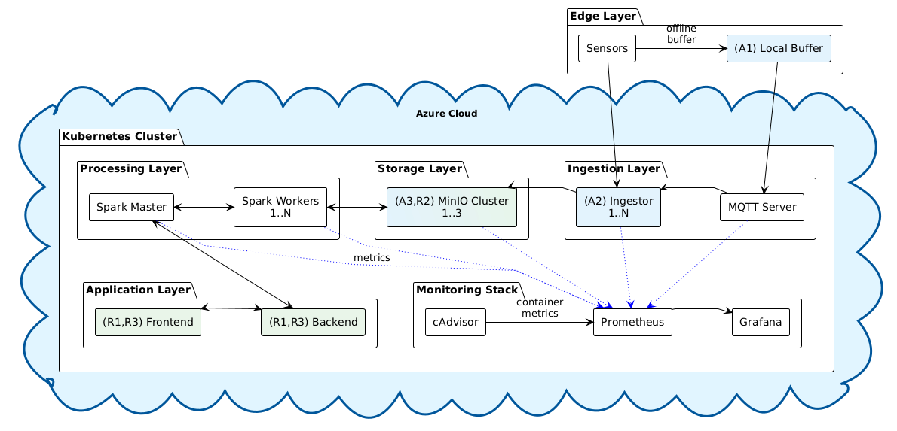

# SOAM — Smart City Ontology-Driven Middleware

SOAM is a middleware platform for integrating heterogeneous IoT sensor data in smart cities. It ingests MQTT and REST sensor streams, normalizes data against an OWL ontology, processes it through a medallion data lake (Bronze → Silver → Gold), and serves real-time analytics dashboards.



## Table of Contents

- [SOAM — Smart City Ontology-Driven Middleware](#soam--smart-city-ontology-driven-middleware)
  - [Table of Contents](#table-of-contents)
  - [Key Components](#key-components)
  - [Tech Stack](#tech-stack)
  - [Project Structure](#project-structure)
  - [Prerequisites](#prerequisites)
  - [Local Development](#local-development)
    - [1. Start a local Docker registry](#1-start-a-local-docker-registry)
    - [2. Install the Spark cluster via Helm](#2-install-the-spark-cluster-via-helm)
    - [3. Start the development environment](#3-start-the-development-environment)
    - [Running services outside the cluster (optional)](#running-services-outside-the-cluster-optional)
  - [Running the Application](#running-the-application)
  - [Service Endpoints](#service-endpoints)
  - [Azure Deployment](#azure-deployment)
  - [CI/CD](#cicd)
  - [Additional Documentation](#additional-documentation)

## Key Components

| Component | Description |
|-----------|-------------|
| **Backend** | FastAPI service that orchestrates Spark jobs, manages devices/rules, and serves the REST API |
| **Frontend** | React dashboard for browsing sensor data, configuring normalization rules, and viewing analytics |
| **Ingestor** | Receives MQTT and REST sensor data, buffers it, and writes Parquet files to MinIO (bronze layer) |
| **Spark** | Structured Streaming jobs that enrich bronze data into silver (normalized) and gold (aggregated) layers |
| **MinIO** | S3-compatible object storage used as the data lake across all medallion layers |
| **Neo4j** | Graph database storing the smart city ontology and semantic relationships |
| **Simulator** | MQTT publisher that generates synthetic sensor data for development and testing |
| **Monitoring** | Prometheus metrics collection and Grafana dashboards for pipeline observability |

## Tech Stack

- **Backend:** Python 3.12, FastAPI, PySpark 3.5, SQLAlchemy, Delta Lake
- **Frontend:** TypeScript, React 18, Vite, React-Bootstrap, Recharts
- **Data:** MinIO (S3), Neo4j, SQLite, Delta Lake, Apache Spark
- **Infrastructure:** Docker, Kubernetes, Skaffold, Helm (Spark chart)
- **Monitoring:** Prometheus, Grafana, cAdvisor
- **Cloud:** Azure AKS, Azure ACR, Terraform

## Project Structure

```
soam/
├── backend/               # FastAPI + PySpark service
│   └── src/
│       ├── api/           # REST API routers
│       ├── database/      # SQLAlchemy models and migrations
│       ├── spark/         # Streaming, enrichment, and data access
│       ├── services/      # Business logic and external clients
│       └── main.py        # Application entrypoint
├── frontend/              # React (Vite) dashboard
│   └── src/
│       ├── api/           # Backend API client layer
│       ├── components/    # Reusable UI components
│       ├── hooks/         # Custom data-fetching hooks
│       ├── pages/         # Route-level page components
│       └── context/       # React contexts (auth, config, error)
├── ingestor/              # MQTT/REST ingestion service
│   └── src/
│       ├── connectors/    # Data source connectors (MQTT, REST)
│       ├── storage/       # MinIO client with buffered writes
│       └── services/      # Data handling and metadata extraction
├── simulator/             # MQTT sensor data simulator
├── rest-api-simulator/    # REST API data source simulator
├── coap-simulator/        # CoAP protocol simulator
├── spark/                 # Custom Spark Docker image
├── k8s/                   # Kubernetes manifests
├── terraform/             # Azure AKS infrastructure as code
├── grafana/               # Grafana dashboards and provisioning
├── prometheus/            # Prometheus configuration
├── monitoring/            # Additional monitoring config
├── scripts/               # Setup and utility scripts
├── tests/                 # Integration and performance tests
├── skaffold.yaml          # Local dev orchestration
└── spark-values.yaml      # Helm values for Spark cluster
```

## Prerequisites

The following tools must be installed on your machine:

| Tool | Version | Purpose |
|------|---------|---------|
| [Docker Desktop](https://www.docker.com/products/docker-desktop/) | Latest | Container runtime with Kubernetes enabled |
| [Skaffold](https://skaffold.dev/docs/install/) | v2+ | Local Kubernetes development workflow |
| [kubectl](https://kubernetes.io/docs/tasks/tools/) | Latest | Kubernetes CLI |
| [Helm](https://helm.sh/docs/intro/install/) | v3+ | Spark cluster deployment |
| [Python](https://www.python.org/downloads/) | 3.12 | Backend and ingestor local development |
| [Node.js](https://nodejs.org/) | 18+ | Frontend local development |
| [Pipenv](https://pipenv.pypa.io/) | Latest | Python dependency management |

**Enable Kubernetes** in Docker Desktop: Settings → Kubernetes → Enable Kubernetes.

## Local Development

### 1. Start a local Docker registry

Skaffold pushes built images to a local registry instead of a remote one:

```powershell
docker run -d -p 5000:5000 --name registry registry:2
```

### 2. Install the Spark cluster via Helm

The Spark master and workers run as a Helm release (not managed by Skaffold):

```powershell
helm install soam oci://registry-1.docker.io/bitnamicharts/spark --version 6.3.16 -f spark-values.yaml
```

### 3. Start the development environment

Skaffold builds all Docker images, deploys Kubernetes manifests, and sets up port forwarding:

```powershell
skaffold dev --trigger=polling --watch-poll-interval=5000 --default-repo=localhost:5000/soam
```

This command watches for file changes and automatically rebuilds/redeploys affected services.

### Running services outside the cluster (optional)

For faster iteration on a single service, you can run it locally while the rest stays in Kubernetes:

```powershell
# Backend
cd backend
pipenv install
pipenv shell
uvicorn src.main:app --host 0.0.0.0 --port 8000 --reload

# Frontend
cd frontend
npm install
npm run dev

# Ingestor
cd ingestor
pipenv install
pipenv shell
python src/main.py
```

## Running the Application

Once `skaffold dev` is running and all pods are healthy, the platform operates automatically:

1. The **simulator** publishes synthetic MQTT sensor data.
2. The **ingestor** receives messages, buffers them, and writes Parquet files to MinIO (bronze layer).
3. The **backend** starts Spark Structured Streaming jobs that read bronze data, normalize it to silver, and aggregate it to gold.
4. The **frontend** polls the backend API and displays real-time dashboards.

Verify pods are running:

```powershell
kubectl get pods
```

## Service Endpoints

Once port forwarding is active (handled by Skaffold), the following services are available:

| Service | URL | Description |
|---------|-----|-------------|
| Frontend | http://localhost:3000 | Main dashboard UI |
| Backend API | http://localhost:8000 | REST API (FastAPI docs at `/docs`) |
| Ingestor API | http://localhost:8001 | Ingestion service API |
| Spark Master | http://localhost:8080 | Spark cluster management UI |
| MinIO Console | http://localhost:9090 | Object storage browser |
| MinIO S3 API | http://localhost:9000 | S3-compatible API |
| Neo4j Browser | http://localhost:7474 | Graph database UI |
| Grafana | http://localhost:3001 | Monitoring dashboards |
| Prometheus | http://localhost:9091 | Metrics query UI |

## Azure Deployment

SOAM can be deployed to Azure Kubernetes Service (AKS) using the provided Terraform configuration and deployment script. See the [Azure Deployment Guide](docs/azure-deployment.md) for full details.

```powershell
az login --tenant <your-tenant-id>
cd terraform

.\deploy.ps1 -Action deploy          # Full deployment
.\deploy.ps1 -Action status          # Check status
.\deploy.ps1 -Action port-forward    # Forward ports to localhost
.\deploy.ps1 -Action destroy         # Tear down
```

| Action | Description |
|--------|-------------|
| `deploy` | Full deployment (Azure infra + Docker images + K8s resources) |
| `deploy -Step 1` | Azure infrastructure only (AKS + ACR) |
| `deploy -Step 2` | Kubernetes resources only |
| `deploy -SkipImages` | Deploy without rebuilding images |
| `destroy` | Destroy all resources |
| `destroy -Step 2` | Destroy K8s resources only (keep Azure infra) |
| `status` | Show deployment status and URLs |
| `port-forward` | Forward all service ports to localhost |
| `images-only` | Build and push Docker images only |

## CI/CD

GitHub Actions workflows automate deployment to AKS. See the [CI/CD Guide](docs/github-actions-cicd.md) for setup instructions.

**Setup:** Create an Azure Service Principal and store the credentials as a GitHub secret named `AZURE_CREDENTIALS`:

```bash
az login
SUBSCRIPTION_ID=$(az account show --query id -o tsv)
az ad sp create-for-rbac \
  --name "soam-github-actions" \
  --role contributor \
  --scopes /subscriptions/$SUBSCRIPTION_ID \
  --sdk-auth
```

Add the JSON output at: **Settings → Secrets and variables → Actions → New repository secret**.

**Available workflows:**

| Workflow | Purpose |
|----------|---------|
| Deploy Infrastructure | Create Azure resources (AKS + ACR) |
| Deploy Application | Build images and deploy K8s resources |
| Update Images | Rebuild specific images and restart pods |
| Cleanup | Destroy all Azure resources |

## Additional Documentation

| Document | Description |
|----------|-------------|
| [Azure Deployment Guide](docs/azure-deployment.md) | Step-by-step AKS deployment with Terraform |
| [AI Copilot Setup](docs/copilot-setup.md) | Azure OpenAI integration for natural-language computations |
| [CI/CD Guide](docs/github-actions-cicd.md) | GitHub Actions workflow configuration |
| [Dependability Criteria](docs/dependability-criteria.md) | System dependability requirements and design |
| [Experimental Validation](docs/experimental-results-validation.md) | Test procedures and evidence for dependability mechanisms |
| [Testing Guide](docs/testing-dependability-features.md) | How to test dependability features |

