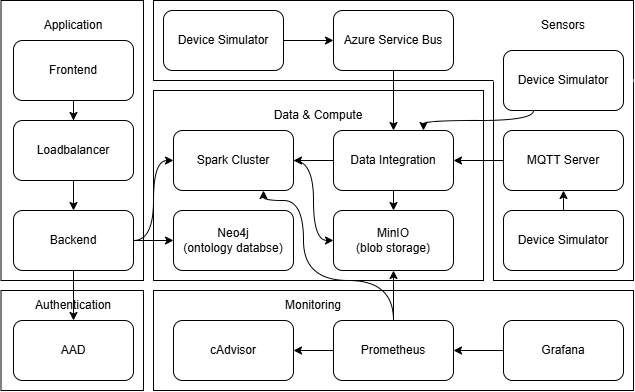

# SOAM: An Ontology-Driven Middleware Platform for Integrating Heterogeneous Data in Smart Cities


## Table of Contents

- [SOAM: An Ontology-Driven Middleware Platform for Integrating Heterogeneous Data in Smart Cities](#soam-an-ontology-driven-middleware-platform-for-integrating-heterogeneous-data-in-smart-cities)
  - [Table of Contents](#table-of-contents)
  - [Documentation](#documentation)
    - [Overview](#overview)
    - [Project Structure](#project-structure)
    - [Summary of Local Pages:](#summary-of-local-pages)
    - [Architecture Diagram](#architecture-diagram)
    - [Local Development](#local-development)
      - [Pre-requisites](#pre-requisites)
      - [Skaffold](#skaffold)
    - [Azure Deployment (Production)](#azure-deployment-production)

## Documentation

For detailed feature-specific documentation, see the `docs/` folder:

- **🤖 [AI Copilot Setup Guide](docs/copilot-setup.md)** - Azure OpenAI-powered computation generation
- **☁️ [Azure Deployment Guide](docs/azure-deployment.md)** - Deploy to AKS with Terraform


### Overview

SOAM is a smart-city data platform that ingests heterogeneous sensor streams, normalizes data against an ontology, and provides analytics and observability. It includes:

- Backend: FastAPI + PySpark + SQLAlchemy, with MinIO S3 integration, Neo4j, and structured logging
- Frontend: React + Vite + React-Bootstrap, for browsing data, rules, and health
- Streaming: MQTT ingestion, Spark batch/streaming jobs, Delta Lake storage on MinIO
- Monitoring: Prometheus + Grafana, cAdvisor
- Copilot: Azure OpenAI-powered computation generation using natural language
- Kubernetes manifests and Terraform scripts for AKS deployment

### Project Structure

```
soam/
├─ backend/                # FastAPI service with Spark helpers and DB models
│  ├─ Dockerfile
│  └─ src/
│     ├─ api/              # FastAPI routers (health, minio, feedback, normalization)
│     ├─ database/         # SQLAlchemy models and DB helpers
│     ├─ logging_config.py # JSON logging configuration
│     ├─ middleware.py     # Request ID middleware
│     ├─ neo4j/            # Neo4j routes/integration
│     ├─ spark/            # Spark utilities (cleaner, usage tracker, routes)
│     └─ main.py           # FastAPI app entrypoint
├─ frontend/               # React (Vite) app
│  ├─ Dockerfile
│  └─ src/
│     ├─ api/              # API client for backend endpoints
│     ├─ components/       # UI building blocks
│     ├─ pages/            # Main pages (Dashboard, Normalization Rules, etc.)
│     └─ context/          # React contexts (config, error)
├─ ingestor/               # MQTT and REST API ingestion service
├─ simulator/              # MQTT test publishers
├─ rest-api-simulator/     # REST API data source with auto-registration
├─ grafana/                # Grafana setup and dashboards
├─ prometheus/             # Prometheus setup
├─ k8s/                    # Kubernetes manifests for core services
├─ spark/                  # Spark image and configs
├─ skaffold.yaml           # Skaffold config (build + deploy)
├─ terraform/              # Azure AKS deployment with Terraform
└─ tests/                  # Test scripts/utilities
```

### Summary of Local Pages:

- **[Frontend](http://localhost:3000):** Accessible at `http://localhost:3000`
- **[Backend](http://localhost:8000):** Accessible at `http://localhost:8000`
- **[Spark Master UI](http://localhost:8080):** Accessible at `http://localhost:8080`
- **[MinIO S3 API](http://localhost:9000):** Accessible at `http://localhost:9000`
- **[MinIO Web Console](http://localhost:9090):** Accessible at `http://localhost:9090`
- **[Neo4j Web UI](http://localhost:7474):** Accessible at `http://localhost:7474`
- **[Cadvisor Web UI](http://localhost:8089/metrics):** Accessible at `http://localhost:8089/metrics`
- **[Prometheus Web UI](http://localhost:9091):** Accessible at `http://localhost:9091`
- **[Grafana Web UI](http://localhost:3001):** Accessible at `http://localhost:3001`


### Architecture Diagram

<div style="border: 2px solid black; padding: 10px; display: inline-block;">
    
</div>

### Local Development

#### Pre-requisites

- Start local registry for Skaffold:

```powershell
# Start a local Docker registry
docker run -d -p 5000:5000 --name registry registry:2

# Set Skaffold default repository
skaffold config set default-repo localhost:5000/soam
```

#### Skaffold

> [!NOTE]
> Skaffold is used for local development with Kubernetes. Ensure you have a local K8s cluster running (e.g., Minikube or Docker Desktop).

```bash
skaffold dev --trigger=polling --watch-poll-interval=5000 --default-repo=localhost:5000/soam
```

### Azure Deployment (Production)

For deploying SOAM to Azure Kubernetes Service (AKS) using Terraform, see the **[Azure Deployment Guide](docs/azure-deployment.md)**.

Quick start:
```powershell
az login
cd terraform
.\deploy.ps1 -Action deploy # this will build and push images, then deploy to AKS
.\deploy.ps1 -Action destroy # to tear down the deployment
```
