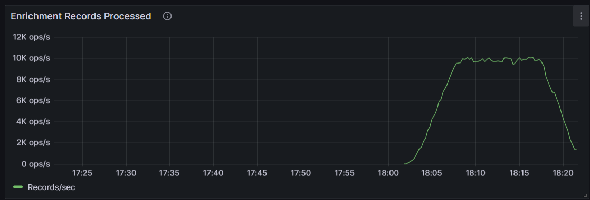
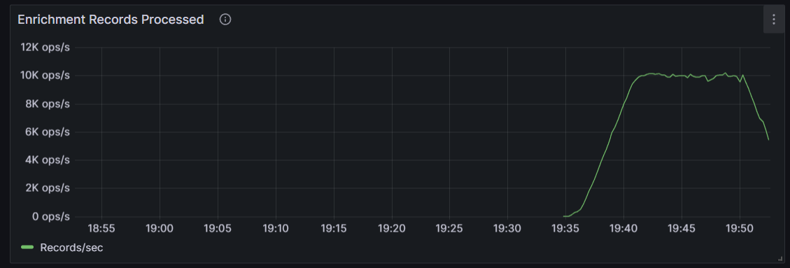

# Baseline Comparison: Dynamic Schema Inference vs Fixed Schema

## Research Question

> *Can dynamic schema inference be added to the enrichment pipeline without reducing throughput?*

## Experiment Design

The experiment compares the **same pipeline** running in two modes:

| Mode                  | Schema                             | Normalization                    | DB Queries                                             | Description                                       |
| --------------------- | ---------------------------------- | -------------------------------- | ------------------------------------------------------ | ------------------------------------------------- |
| **Dynamic** (current) | Fetched from ingestor metadata API | Full normalization rules from DB | Schema inference + normalization rules + device filter | The production pipeline with all dynamic features |
| **Fixed** (baseline)  | Hardcoded `StructType`             | Skipped entirely                 | None — maps built directly with `create_map()`         | Bypasses all dynamic operations                   |

**What stays identical in both modes:**
- Spark readStream from bronze parquet files
- `BatchProcessor._write_to_delta()` write path
- Trigger interval, `maxFilesPerTrigger`, checkpoint config
- Same ingestor + MQTT publisher generating data
- Same cluster resources (AKS nodes, Spark workers)

**What the bypass skips:**
- HTTP call to ingestor metadata API for schema
- Database query for normalization rules
- `DataCleaner.normalize_to_union_schema()` column normalization
- `UnionSchemaTransformer.legacy_to_union()` map conversion
- `ValueTransformationProcessor.apply_transformations()`
- `DeviceFilter.get_allowed_ingestion_ids()` DB query

## Test Setup

| Parameter      | Value                                                                |
| -------------- | -------------------------------------------------------------------- |
| Cluster        | Azure AKS (Standard_D4s_v5)                                          |
| Namespace      | `soam`                                                               |
| Publisher pods | 4 × 2,500 msg/s = 10,000 msg/s total                                 |
| Test duration  | 900 seconds (15 minutes) per mode                                    |
| Cooldown       | 90 seconds                                                           |
| Metrics window | `rate(...[3m])` captured immediately after publisher completes       |
| MQTT topic     | `smartcity/sensors/perf_test`                                        |
| Payload        | `{temperature, humidity, timestamp, sensor_id, thread_id, sequence}` |

## Results

| Metric                                    | Dynamic Schema | Fixed Schema (Bypass) |
| ----------------------------------------- | -------------- | --------------------- |
| **Throughput rate (rec/s)**               | 10,255         | 10,425                |
| **Effective throughput (total/duration)** | 9,502          | 9,438                 |
| **Total records processed**               | 8,552,181      | 8,494,157             |

**Overhead: 1.6% (rate) / -0.7% (effective) — NEGLIGIBLE**

The dynamic schema inference pipeline processes data at effectively the same rate as the fixed-schema baseline. The ~1.6% difference in instantaneous rate is within normal variance and reverses when measured as effective throughput over the full test duration.

### Raw Results (JSON)

<details>
<summary>Dynamic schema inference</summary>

```json
{
  "mode": "Dynamic schema inference",
  "bypass": false,
  "target_rate": 10000,
  "duration_seconds": 900,
  "cooldown_seconds": 90,
  "pods": 4,
  "namespace": "soam",
  "throughput_rate": 10255.1,
  "effective_throughput": 9502.4,
  "total_processed": 8552181.0,
  "timestamp": "2026-04-18T18:19:00"
}
```

</details>

<details>
<summary>Fixed schema (bypass)</summary>

```json
{
  "mode": "Fixed schema (bypass)",
  "bypass": true,
  "target_rate": 10000,
  "duration_seconds": 900,
  "cooldown_seconds": 90,
  "pods": 4,
  "namespace": "soam",
  "throughput_rate": 10425.1,
  "effective_throughput": 9438.0,
  "total_processed": 8494157.0,
  "timestamp": "2026-04-18T19:51:49"
}
```

</details>

## Grafana Throughput Graphs

### Dynamic Schema Inference (Current Pipeline)



The enrichment pipeline sustains ~10K records/sec throughout the 15-minute test window. The ramp-up at the start and drop-off at the end correspond to the publisher starting and stopping.

### Fixed Schema Bypass (Baseline)



The bypass pipeline shows an identical throughput profile — ~10K records/sec sustained, with the same ramp-up/drop-off pattern. The visual similarity confirms the quantitative result: dynamic schema inference adds no measurable overhead.

## Conclusion

Dynamic schema inference, normalization rule lookup, and value transformation add **negligible overhead** (< 2%) to the enrichment pipeline throughput. The pipeline processes ~10,000 records/second regardless of whether schemas are inferred dynamically or hardcoded.

This directly answers the research question: **dynamic schema inference can be added without reducing throughput.**

## Reproducing the Experiment

### Prerequisites
- AKS cluster with SOAM deployed (`-n soam`)
- `kubectl` context set to the cluster

### Run individual tests

```powershell
# Dynamic mode
.\tests\baseline\run_single_test.ps1 -Namespace soam -Rate 10000 -Duration 900 -Pods 4 -OutputFile dynamic.json

# Bypass mode
.\tests\baseline\run_single_test.ps1 -Namespace soam -Rate 10000 -Duration 900 -Pods 4 -Bypass -OutputFile bypass.json

# Compare
.\tests\baseline\compare_results.ps1 -DynamicFile dynamic.json -BypassFile bypass.json
```

### Toggle bypass mode manually

```powershell
# Enable bypass
kubectl set env statefulset/backend SPARK_BYPASS_ENRICHMENT=true -n soam

# Disable bypass (restore normal)
kubectl set env statefulset/backend SPARK_BYPASS_ENRICHMENT=false -n soam
```
