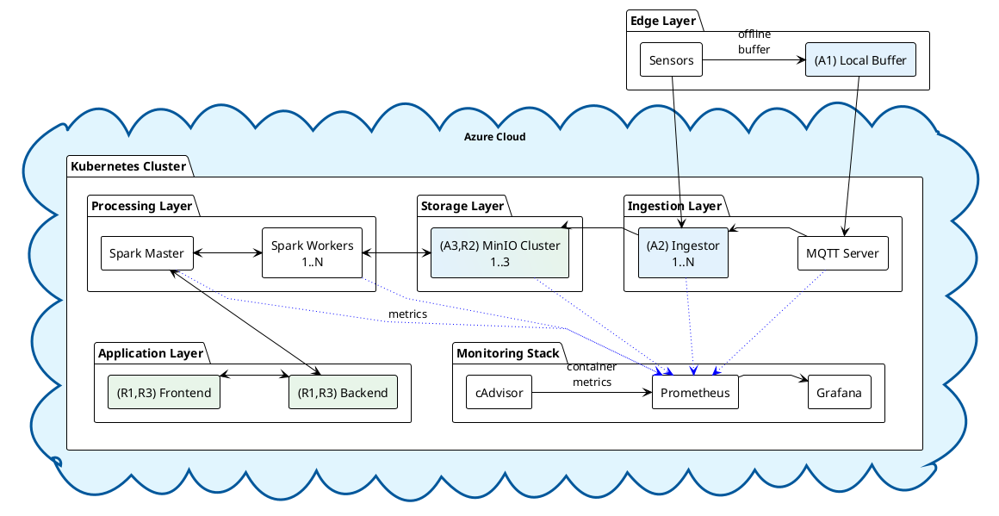

# Architecture for Big Data - Vladislav Tiftilov

## Dependability Criteria

### 1. **Availability**
System remains operational and accessible despite failures.

**Threats**: MQTT/Service Bus disconnections, Spark/storage failures, network partitions

**Implementation**:
- Local buffer at edge for offline tolerance
- Auto-scaling ingestor instances for load handling
- Azure Service Bus with built-in high availability
- Spark workers auto-scaling (2-10 instances) based on load
- MinIO 3-node cluster for storage redundancy
- Health monitoring and auto-restart

### 2. **Reliability**
System delivers correct, uncorrupted data without loss.

**Threats**: Storage corruption, data loss during transmission

**Implementation**:
- User authentication and authorization
- Sensor authentication via MQTT client certificates
- User authentication through Azure AD integration
- Data labeling with source metadata and quality scores
- Automated backup policies with 30-day retention in MinIO
- Point-in-time recovery capability for critical data
