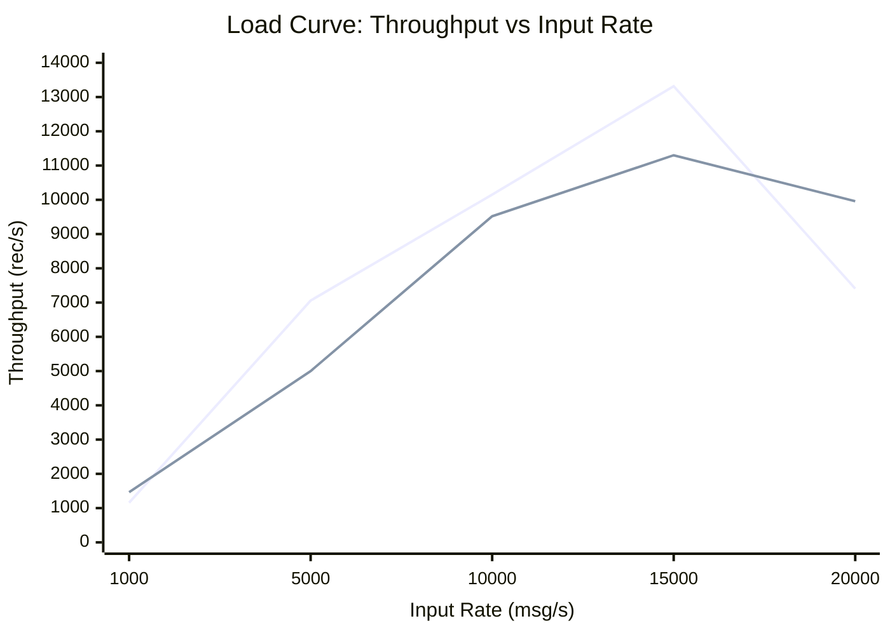

# Load Curve Test: Throughput Saturation Analysis

## Purpose

Determine the maximum sustained throughput of the enrichment pipeline by gradually increasing the input message rate until throughput saturates.

## Experiment Design

The test sends MQTT messages at progressively increasing rates (1K → 5K → 10K → 15K → 20K msg/s), running each rate for 10 minutes. The pipeline processes data continuously without cleanup between steps — only the input rate changes. This shows where the pipeline can keep up with input and where it starts falling behind.

## Test Setup

| Parameter              | Value                                                |
| ---------------------- | ---------------------------------------------------- |
| Cluster                | Azure AKS (Standard_D4s_v5)                          |
| Namespace              | `soam`                                               |
| Publisher pods         | 5                                                    |
| Rates tested           | 1,000 → 5,000 → 10,000 → 15,000 → 20,000 msg/s       |
| Duration per rate      | 600 seconds (10 minutes)                             |
| Cooldown between steps | 60 seconds                                           |
| Metrics window         | `rate(...[3m])` captured immediately after each step |
| Total test time        | ~55 minutes                                          |

## Results

| Input Rate (msg/s) | Throughput Rate (rec/s) | Effective Throughput (rec/s) | Total Records Processed |
| -----------------: | ----------------------: | ---------------------------: | ----------------------: |
|              1,000 |                   1,159 |                        1,464 |                 878,101 |
|              5,000 |                   7,058 |                        5,000 |               3,000,119 |
|             10,000 |                  10,152 |                        9,519 |               5,711,565 |
|             15,000 |                  13,317 |                       11,301 |               6,780,413 |
|             20,000 |                   7,407 |                        9,959 |               5,975,661 |

**Peak throughput: ~11,300 rec/s at 15,000 msg/s input**



## Analysis

The results show a clear saturation curve:

- **1K–10K msg/s**: The pipeline keeps up with the input rate. Throughput scales linearly — at 10K input, the pipeline processes ~10K rec/s.
- **15K msg/s**: Throughput reaches its peak at ~11.3K rec/s effective, but the pipeline can no longer keep up with the full 15K input rate. The gap indicates data is buffering in the ingestor/MinIO faster than Spark can process it.
- **20K msg/s**: Throughput drops to ~10K rec/s. The pipeline is saturated and the excess input creates backpressure. The instantaneous rate (7.4K) is lower than effective throughput (10K) because the `rate[3m]` capture happens at a moment when batch processing is contending with heavy I/O.

The saturation point is between **10K and 15K msg/s**. Beyond this, increasing the input rate does not increase output throughput — it just increases the processing backlog.

### Bottleneck

The primary bottleneck is the **enrichment stream trigger interval** (5 seconds) combined with `maxFilesPerTrigger=500`. At 15K+ msg/s, the ingestor generates parquet files faster than Spark can consume them in each micro-batch. Scaling options:
- Increase Spark workers (currently 2)
- Reduce trigger interval
- Increase `maxFilesPerTrigger`

## Raw Results (JSON)

<details>
<summary>Load curve results</summary>

```json
{
  "experiment": "load_curve",
  "namespace": "soam",
  "pods": 5,
  "duration_per_rate": 600,
  "metrics_window": "3m",
  "results": [
    {
      "target_rate": 1000,
      "throughput_rate": 1158.6,
      "effective_throughput": 1463.5,
      "total_processed": 878101,
      "duration_seconds": 600
    },
    {
      "target_rate": 5000,
      "throughput_rate": 7057.8,
      "effective_throughput": 5000.2,
      "total_processed": 3000119,
      "duration_seconds": 600
    },
    {
      "target_rate": 10000,
      "throughput_rate": 10152,
      "effective_throughput": 9519.3,
      "total_processed": 5711565,
      "duration_seconds": 600
    },
    {
      "target_rate": 15000,
      "throughput_rate": 13317,
      "effective_throughput": 11300.7,
      "total_processed": 6780413,
      "duration_seconds": 600
    },
    {
      "target_rate": 20000,
      "throughput_rate": 7407.1,
      "effective_throughput": 9959.4,
      "total_processed": 5975661,
      "duration_seconds": 600
    }
  ]
}
```

</details>

## Reproducing the Experiment

### Prerequisites
- AKS cluster with SOAM deployed (`-n soam`)
- `kubectl` context set to the cluster

### Run the load curve

```powershell
.\tests\baseline\run_load_curve.ps1 -Namespace soam -Rates "1000,5000,10000,15000,20000" -Duration 600 -Pods 5
```

The script:
1. Cleans MinIO data and restarts the backend (clean state)
2. Gradually increases the input rate across 5 steps
3. Captures throughput immediately after each step completes
4. Outputs a summary table + JSON file
5. Auto-detects the saturation point
